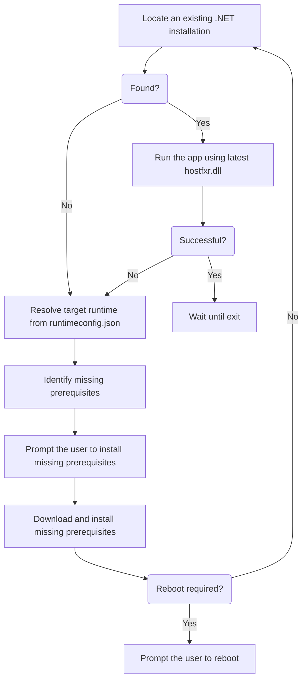

# .NET Runtime Bootstrapper

[](https://vshymanskyy.github.io/StandWithUkraine)
[](https://github.com/Tyrrrz/DotnetRuntimeBootstrapper/actions)
[](https://nuget.org/packages/DotnetRuntimeBootstrapper)
[](https://nuget.org/packages/DotnetRuntimeBootstrapper)
[](https://discord.gg/2SUWKFnHSm)
[](https://tyrrrz.me/donate)
[](https://twitter.com/tyrrrz/status/1495972128977571848)

> 🟢 **Project status**: active<sup>[[?]](https://github.com/Tyrrrz/.github/blob/master/docs/project-status.md)</sup>

**.NET Runtime Bootstrapper** replaces the default application host `exe` file — generated by MSBuild for Windows executables — with a fully featured bootstrapper that can automatically download and install .NET runtime and other missing components required by your application.

## Terms of use<sup>[[?]](https://github.com/Tyrrrz/.github/blob/master/docs/why-so-political.md)</sup>

By using this project or its source code, for any purpose and in any shape or form, you grant your **implicit agreement** to all the following statements:

- You **condemn Russia and its military aggression against Ukraine**
- You **recognize that Russia is an occupant that unlawfully invaded a sovereign state**
- You **support Ukraine's territorial integrity, including its claims over temporarily occupied territories of Crimea and Donbas**
- You **reject false narratives perpetuated by Russian state propaganda**

To learn more about the war and how you can help, [click here](https://tyrrrz.me). Glory to Ukraine! 🇺🇦

## Install

- 📦 [NuGet](https://nuget.org/packages/DotnetRuntimeBootstrapper): `dotnet add package DotnetRuntimeBootstrapper`

## Why?

Currently, .NET offers two main ways of [distributing applications](https://docs.microsoft.com/en-us/dotnet/core/deploying): **framework-dependent** deployment and **self-contained** deployment.
Both of them come with a set of obvious and somewhat less obvious drawbacks:

- **Framework-dependent** deployment:
  - Requires the user to have the correct .NET runtime installed on their machine. Not only will many users inevitably miss or ignore this requirement, the task of installing the _correct_ .NET runtime can be very challenging for non-technical individuals. Depending on their machine and the specifics of your application, they will need to carefully examine the [download page](https://dotnet.microsoft.com/download/dotnet/6.0/runtime) to find the installer for the right version, framework (i.e. base, desktop, or aspnet), CPU architecture, and operating system.
  - Comes with an application host that is _not platform-agnostic_. Even though the application itself (the `dll` file) is portable in the sense that it can run on any platform where the target runtime is supported, the application host (the `exe` file) is a native executable built for a specific platform (by default, the same platform as the dev machine). This means that if the application was built on Windows x64, a user running on Windows x86 will not be able to launch the application through the `exe` file, even if they have the correct runtime installed (`dotnet myapp.dll` will still work, however).
- **Self-contained** deployment:
  - While eliminating the need for installing the correct runtime, this method comes at a significant file size overhead. A very basic WinForms application, for example, starts at around 100 MB in size. This can be very cumbersome when doing auto-updates, but also seems quite wasteful if you consider that the user may end up with multiple .NET applications each bringing their own runtime.
  - Targets a specific platform, which means that you have to provide separate binaries for each operating system and processor architecture that you intend to support. Additionally, it can also create confusion among non-technical users, who may have a hard time figuring out which of the release binaries they need to download.
  - Snapshots a specific version of the runtime when it's produced. This means that your application won't be able to benefit from newer releases of the runtime, potentially containing performance or security improvements, unless you deploy a new version of the application.
  - Is, in fact, _not completely self-contained_. Depending on the user's machine, they might still need to install Visual C++ runtime and required Windows updates, neither of which are packaged with the application. Although this is only required for operating systems older than Windows 10, a big portion of your users may still be using them.

**.NET Runtime Bootstrapper** is a project that provides an alternative _third deployment option_.
Combining the best of both framework-dependent and self-contained deployments, bootstrapped deployment eliminates the above-mentioned issues.

- **Bootstrapped** deployment:
  - Takes care of installing the target .NET runtime automatically. All the user has to do is press "Yes" when prompted and the bootstrapper will download and install the correct version of the runtime on its own.
  - Can also automatically install the Visual C++ runtime and missing Windows updates, when running on older operating systems. This means that users who are still using Windows 7 will have just as seamless experience as those running on Windows 10.
  - Does not have any file size overhead because it doesn't package additional files. Missing prerequisites are downloaded on-demand.
  - Allows your application to benefit from newer releases of the runtime that the user might install in the future. When deploying your application, you are only tying it to a _minimum_ .NET version (within the same major).
  - Is _truly portable_ because the provided application host is a platform-agnostic .NET Framework 3.5 executable, which works out-of-the-box on all environments starting with Windows 7. This means that you only need to share a single distribution of your application, without worrying about different CPU architectures or operating systems.

## Features

- Runs the application in-process using a custom runtime host
- Detects and installs missing dependencies:
  - Required version of .NET runtime
  - Required Visual C++ binaries
  - Required Windows updates
- Works out-of-the-box on Windows 7 and higher
- Supports all platforms in a single executable
- Integrates seamlessly within the build process
- Inherits application resources, such as version info, manifest, and icons
- Imposes no overhead in file size or performance

## Video

https://user-images.githubusercontent.com/1935960/123711355-346ed380-d825-11eb-982f-6272a9e55ebd.mp4

## Usage

To add **.NET Runtime Bootstrapper** to your project, simply install the corresponding [NuGet package](https://nuget.org/packages/DotnetRuntimeBootstrapper).
MSBuild will automatically pick up the `props` and `targets` files provided by the package and integrate them inside the build process.
After that, no further configuration is required.

> ⚠️ Bootstrapper only supports applications targeting **.NET Core 3.0 or higher**.

> ⚠️ Bootstrapper's user experience is optimized for **desktop applications**.
> Other application models are supported in theory but not necessarily in practice.

### Publishing

In order to create a sharable distribution of your application, run `dotnet publish` as you normally would.
This should produce the following files in the output directory:

```txt
MyApp.exe                 <-- bootstrapper's application host
MyApp.exe.config          <-- .NET config required by the application host
MyApp.runtimeconfig.json  <-- runtime config required by the application host
MyApp.dll                 <-- your application
MyApp.pdb
MyApp.deps.json
[... other application dependencies ...]
```

Make sure to include all marked files in your application distribution.

> ⚠️ Single-file deployment (`/p:PublishSingleFile=true`) is not supported by the bootstrapper.

### Application host

The client-facing side of **.NET Runtime Bootstrapper** is implemented as a [custom .NET runtime host](https://docs.microsoft.com/en-us/dotnet/core/tutorials/netcore-hosting).
Internally, it's a pre-compiled managed executable built against legacy .NET Framework v3.5, which allows it to run out-of-the-box on all operating systems starting with Windows 7.

When the user runs the application through the bootstrapper, it executes the following steps:



### Application resources

When the bootstrapper is created, the build task copies important native resources from the target assembly into the application host:

- Application manifest (resource type: `24`). Can be configured by the `<ApplicationManifest>` project property.
- Application icon (resource types: `3` and `14`). Can be configured by the `<ApplicationIcon>` project property.
- Version info (resource type: `16`). Contains values configured by `<FileVersion>`, `<InformationalVersion>`, `<Product>`, `<Copyright>`, and other similar project properties.

Additionally, version info resource is further modified to contain the following attributes:

- `InternalName` set to the application host's file name.
- `OriginalName` set to the application host's file name.
- `AppHost` set to `.NET Runtime Bootstrapper vX.Y.Z` where `X.Y.Z` is the version of the bootstrapper.

### Options

#### Generate bootstrapper on build

By default, bootstrapper is only created when publishing the project (i.e. when running `dotnet publish`).
If you want to also have it created on every build, set the `<GenerateBootstrapperOnBuild>` project property to `true`:

```xml
<Project Sdk="Microsoft.NET.Sdk">

  <PropertyGroup>
    <OutputType>WinExe</OutputType>
    <TargetFramework>net6.0-windows</TargetFramework>
    <!-- ... -->

    <!-- Create bootstrapper on every build, in addition to every publish -->
    <GenerateBootstrapperOnBuild>true</GenerateBootstrapperOnBuild>
  </PropertyGroup>

  <!-- ... -->

</Project>
```

> ⚠️ Bootstrapper's application host does not support debugging.
> In order to retain debugging capabilities of your application during local development, keep `<GenerateBootstrapperOnBuild>` set to `false` (default).

### Troubleshooting

#### Build task logs

If the build process does not seem to produce the bootstrapper correctly, you may be able to get more information by running the command with higher verbosity.
For example, running `dotnet publish --verbosity normal` on `DotnetRuntimeBootstrapper.Demo` project should produce the following section in the output:

```txt
CreateBootstrapperAfterPublish:
 Extracting apphost...
 Extracted apphost to 'f:\Projects\Softdev\DotnetRuntimeBootstrapper\DotnetRuntimeBootstrapper.Demo\bin\Debug\net6.0-windows\DotnetRuntimeBootstrapper.Demo.exe'.
 Extracted apphost config to 'f:\Projects\Softdev\DotnetRuntimeBootstrapper\DotnetRuntimeBootstrapper.Demo\bin\Debug\net6.0-windows\DotnetRuntimeBootstrapper.Demo.exe.config'.
 Injecting target binding...
 Injected target binding to 'DotnetRuntimeBootstrapper.Demo.exe'.
 Injecting manifest...
 Injected manifest to 'DotnetRuntimeBootstrapper.Demo.exe'.
 Injecting icon...
 Injected icon to 'DotnetRuntimeBootstrapper.Demo.exe'.
 Injecting version info...
 Injected version info to 'DotnetRuntimeBootstrapper.Demo.exe'.
 Bootstrapper created successfully.
```

#### Application host logs

In the event of a fatal error, in addition to showing a message to the user, bootstrapper will produce an error dump.
It can be found in the Windows event log under **Windows Logs** → **Application** with event ID `1023` and source `.NET Runtime`.
The dump has the following format:

```txt
Description: Bootstrapper for a .NET application has failed.
Application: DotnetRuntimeBootstrapper.Demo.exe
Path: F:\Projects\Softdev\DotnetRuntimeBootstrapper\DotnetRuntimeBootstrapper.Demo\bin\Debug\net6.0-windows\DotnetRuntimeBootstrapper.Demo.exe
AppHost: .NET Runtime Bootstrapper v2.2.0
Message: System.Exception: Test failure
   at DotnetRuntimeBootstrapper.AppHost.Program.Run(String[] args)
   at DotnetRuntimeBootstrapper.AppHost.Program.Main(String[] args)
```

Older versions of the bootstrapper (version 2.1 and below) instead created an error dump on the file system in either of the following locations:

- File `AppHost_Error_{timestamp}.txt` in the application directory
- File `%LocalAppData%\Tyrrrz\DotnetRuntimeBootstrapper\AppHost_{app}_Error_{timestamp}.txt`

The file format is as follows:

```txt
Timestamp: 05.12.2021 0:10:42 +02:00
AppHost: .NET Runtime Bootstrapper v2.0.0
Message: System.Exception: Test failure
   at DotnetRuntimeBootstrapper.AppHost.Program.Run(String[] args)
   at DotnetRuntimeBootstrapper.AppHost.Program.Main(String[] args)
```